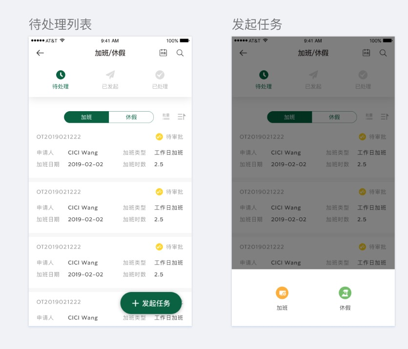
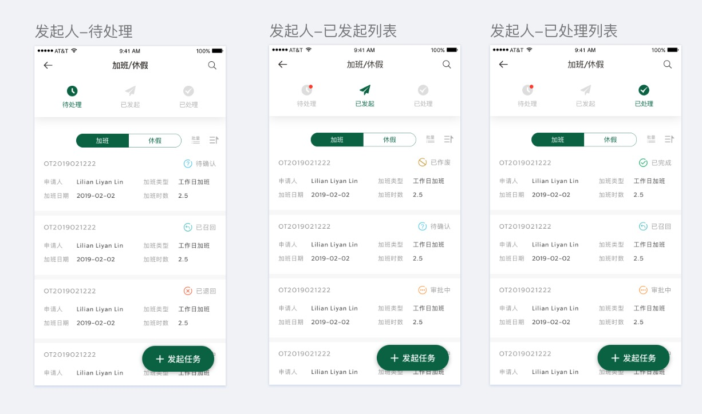
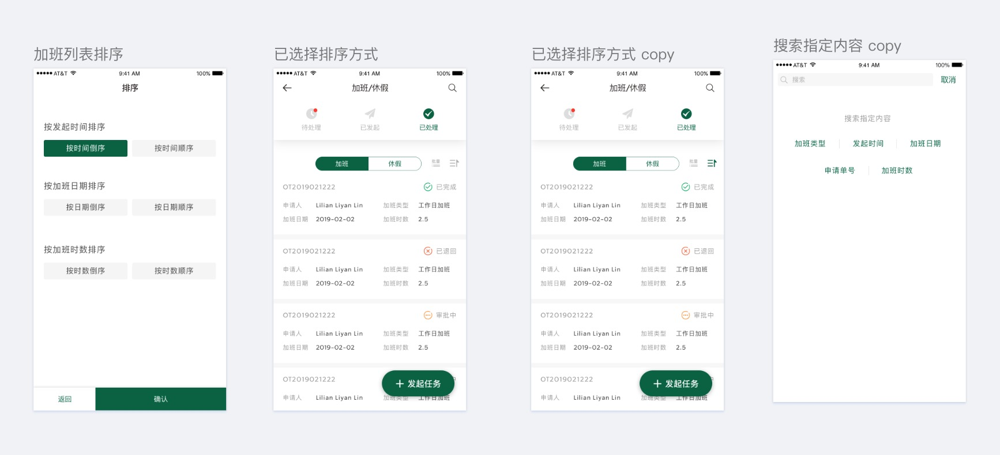
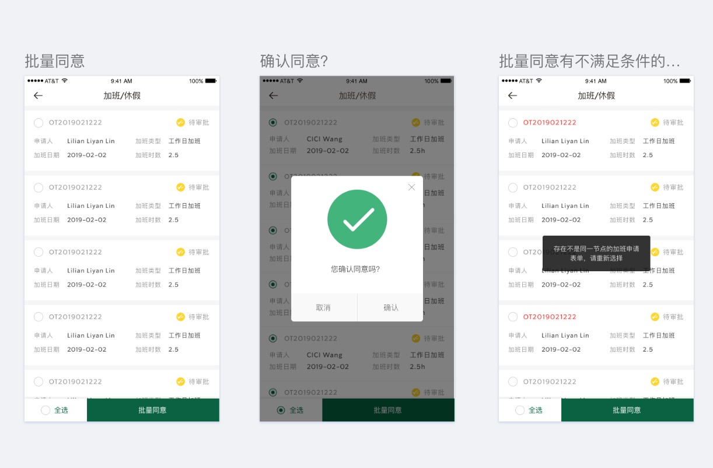
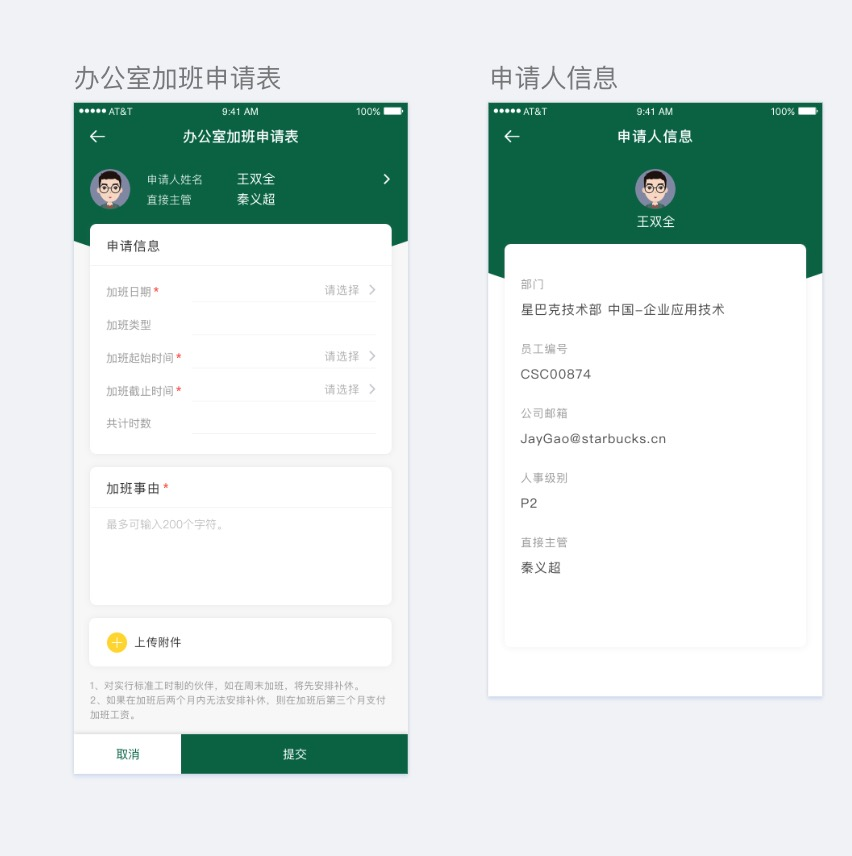
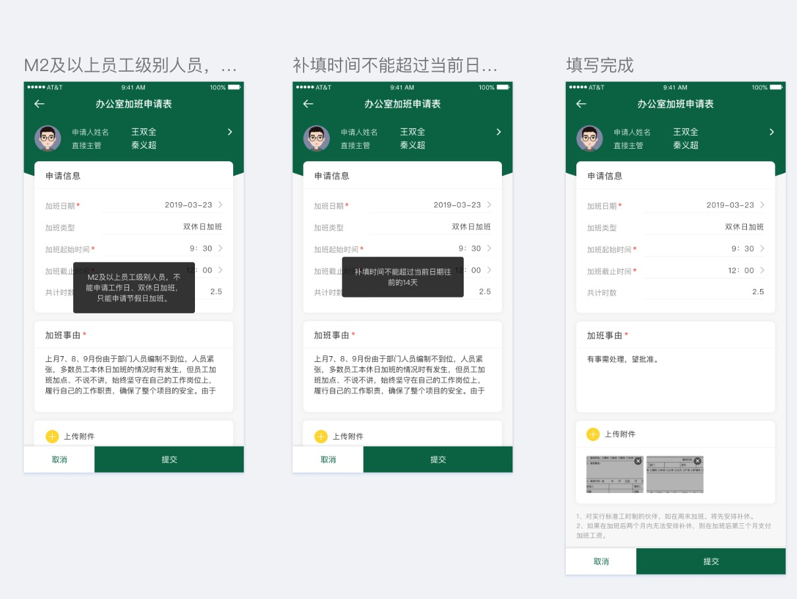
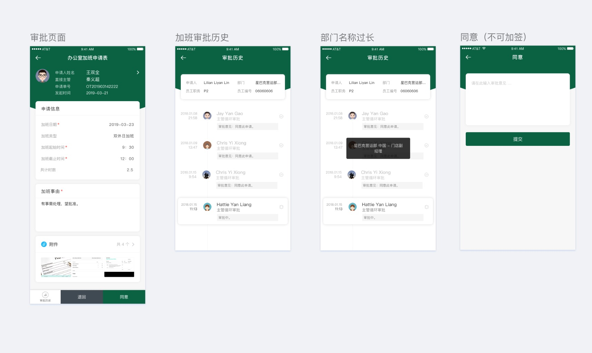

> 项目介绍
对于员工管理app订制的应用，使企业员工可以通过服务终端进行请假申请，请假原因由员工自己把请假的状况填写到后台，点击确定后直属领导便会收到消息，通过审批后请假就成功了，省去了繁琐的请假步骤，让请假变得更简单。

> 技术栈
    vue + vuex + vue-router + webpack+ES6/7 + ajax + sass + flex + axios 
> 项目运行
    git clone https://github.com/hyyabc123/hyy_combat.git
    npm install --save-dev
    npm run dev
    npm run build
> 目录结构 

------
client
src
  │─App.vue   // App主文件组件
  │─main.js   // 主文件入口
  │  
  ├─api        // 接口汇总文件
  │      index.js  // 接口汇总文件
  │      
  ├─components       // 全局组件文件
  │  │  Header.vue   // 头部组件
  │  │  
  │  └─Dialog.vue    // 遮罩组件
  │          index.vue
  │          
  ├─plugins         // 注册全局组件
  │      base-ui.js
  │      
  ├─router           
  │      index.js // 路由列表
  │      
  ├─static             // 静态资源
  │  ├─css     
  │  │      style.scss
  │  │      
  │  └─images
  │          1.jpg
  │          2.jpg
  │          
  ├─store              // vuex 仓库
  │  │  index.js
  │  │  
  │  └─modules         // 仓库模块
  │          Info.js
  │          
  ├─uitle              // 公用的资源
  │  │  flexible.js
  │  │  
  │  ├─fonts
  │  │      demo.css
  │  │      demo_fontclass.html
  │  │      iconfont.css
  │  │      iconfont.eot
  │  │      iconfont.js
  │  │      iconfont.svg
  │  │      iconfont.ttf
  │  │      iconfont.woff
  │  │      ygyxsziti2.0.ttf
  │  │      
  │  ├─request         //axios 二次封装
  │  │      index.js
  │  │      
  │  └─scss
  │          common.css
  │          common.min.css
  │          common.scss
  │          _mixin.css
  │          _mixin.min.css
  │          _mixin.scss
  │          
  └─views              // 视图组件文件
      ├─apply          // 提交组件
      │      index.vue
      │      ischeck.js
      │      
      ├─detail         // 详情页组件
      │      index.vue
      │      
      ├─dialog         // 遮罩组件
      │      index.vue
      │      
      ├─home           // 主页组件
      │  │  index.vue
      │  │  
      │  └─components  // 主页拆分组件
      │          list.vue    // 列表组件
      │          Mynav.vue     // 导航组件
      │          Subnav.vue    //  sub导航组件
      │          
      ├─login          // 登录组件
      │      index.vue
      │      
      ├─search         // 搜索组件
      │      index.vue
      │      
      └─sort           // 排序组件
              index.vue
              

> 部分截图

